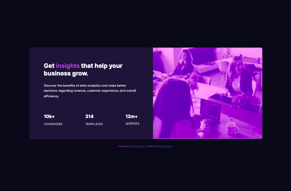

# Frontend Mentor - Stats preview card component solution

This is a solution to the [Stats preview card component challenge on Frontend Mentor](https://www.frontendmentor.io/challenges/stats-preview-card-component-8JqbgoU62). Frontend Mentor challenges help you improve your coding skills by building realistic projects. 

## Table of contents

- [Overview](#overview)
  - [The challenge](#the-challenge)
  - [Screenshot](#screenshot)
  - [Links](#links)
- [My process](#my-process)
  - [Built with](#built-with)
  - [What I learned](#what-i-learned)
  - [Continued development](#continued-development)
  - [Useful resources](#useful-resources)
- [Author](#author)
- [Acknowledgments](#acknowledgments)

## Overview

### The challenge

Users should be able to:

- View the optimal layout depending on their device's screen size

### Screenshot

### Links

- Solution URL: [Repo](https://github.com/kjm2023/fm-stats-preview-card-component-main.git)
- Live Site URL: [GitHub Page](https://kjm2023.github.io/fm-stats-preview-card-component-main/)

## My process

### Built with

- Semantic HTML5 markup
- CSS custom properties
- Flexbox

### What I learned

This project afforded me the opportunity to explore a different way of sharing images (mobile image versus desktop image).

### Continued development

I would love to explore images and image loading options for mobile versus desktop. Any helpful resources or advice are more than welcomed. I am also interested in getting an image that is not a background image to truly grow with the container. I ended up with a new 'design' between viewports.

### Useful resources

- [Mix Blend Mode](https://developer.mozilla.org/en-US/docs/Web/CSS/mix-blend-mode) - Blend modes are everything. Who knew we had Photoshop options on the web!
- [Prevent Images from Shrinking with Flex Box](https://befused.com/css/flexbox-prevent-image-shrinking/) - This truly helped with the sizing.

## Author

- Frontend Mentor - [@kjm2023](https://www.frontendmentor.io/profile/kjm2023)

## Acknowledgments

Thanks to my coding crew at [GDI](http://girldevelopit.org) (Girl Develop It!) as well as the amazing folks at FrontEnd Mentor. 

